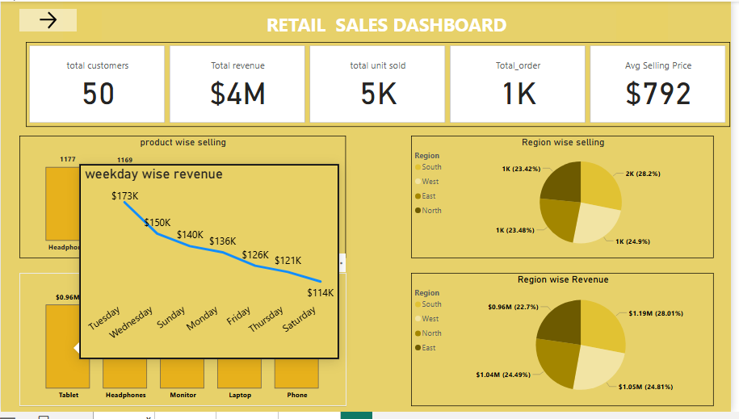
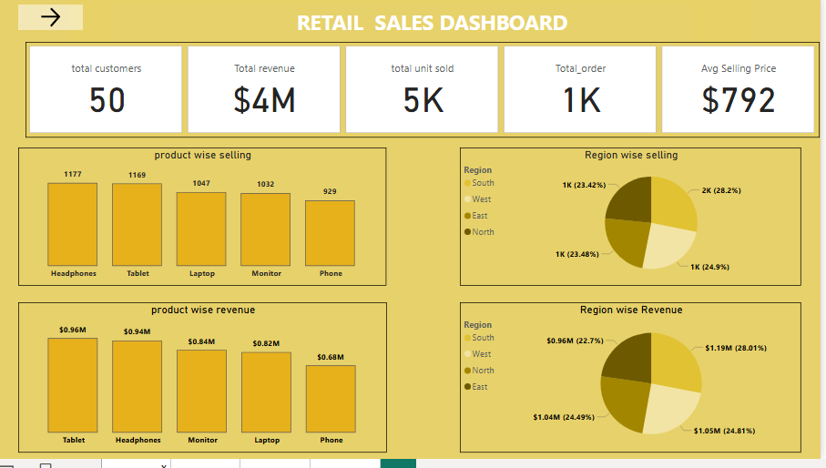
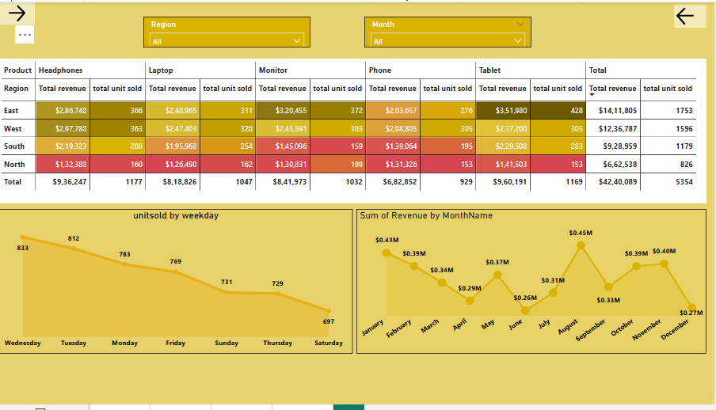

# 🛒 Retail Sales Dashboard – Power BI Project

This Power BI project visualizes and analyzes the sales performance of a retail company across products, regions, and time. It includes key KPIs, detailed drilldowns, and actionable business insights to support data-driven decisions.

## 📊 Dashboard Overview

### ✅ Key Metrics:
- Total Revenue: **$4M**
- Total Units Sold: **5K**
- Total Orders: **1K**
- Average Selling Price: **$792**
- Total Customers: **50**

## 📦 Product-Level Insights

- **Top-selling products**: Headphones and Tablets
- **Highest revenue product**: Tablets ($0.96M)
- **Underperforming product**: Phones

## 🌍 Region & Segment Insights

- **Top Revenue Region**: West ($1.26M)
- **Lowest Performing Region**: North
- **Top Segment**: Home Office (highest revenue & units sold)

## 📈 Time-Based Trends

- Revenue breakdown by **weekday and month**
- No strong **seasonal trend** detected — suggests external factors (promotion, availability, etc.)

## 🧠 Business Takeaways

- 📌 **Focus on Tablets** for advertising and stocking — highest ROI product
- 📌 **Investigate Phone sales** — consistently underperforming
- 📌 **South region** is a strong market → allocate more stock here
- 📌 **Home Office** segment drives the most revenue → tailor offers
- 📌 Revenue fluctuates month-to-month → plan around variability

## 🧰 Tools & Features Used

- Power BI Desktop
- DAX Calculations
- Slicers for Region & Month filtering
- Tooltip Pages
- Pie, Line, Column Charts
- Conditional Formatting in Matrix
  

## 🧠 Advanced Feature: Tooltip Page

This report includes a **custom tooltip page** to show **weekday-wise revenue** when hovering over visuals. This improves UX by providing quick insights without crowding the main report.

📷 Tooltip Preview:

## 🖼️ Dashboard Previews

### 📍 Page 1 – KPI & Overview

### 📍 Page 2 – Region, Month & Trend Analysis

### 📍 Page 3 – Segment Analysis & Insights

---

## 📂 Files Included

- `retail_sales_dashboard.pbix`
- `Dashboard-1.png`
- `Dashboard-2.png`
- `Dashboard-3.png`
-  Tooltip-1.png`
- `README.md`

## 🙋 About Me

Hi! I'm **Shehha**, an aspiring data analyst with a passion for turning raw data into meaningful stories.  
Feel free to connect or reach out for collaborations, feedback.

---

## 🔗 Connect With Me

- 📧 Email: [shehhamathi@gmail.com]

